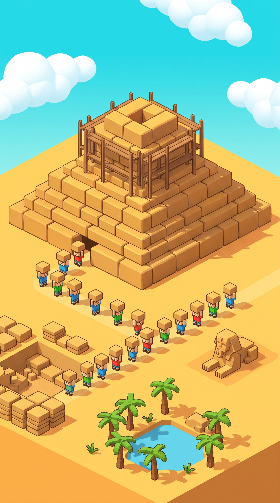

# Pyramid Live

Interactive TikTok LIVE game in Godot 4: the whole chat builds one pyramid together.
Cartoon, Roblox-like look, vertical 1080×1920, runs as a native window (no browser), so it uses the GPU fully.



## How it plays

| Viewer action | In the game |
|---|---|
| Likes | every 5 likes from a viewer spawn **their own worker** (with a Minecraft-style name tag) who places 1 block; no likes for 15 s and the worker vanishes in a puff |
| Gift | 1 coin = 10 blocks, a banner with the avatar, a random meme sound |
| Follow | +5 blocks and your own worker that stays for the whole stream |
| GG, Fireworks, Boxing Gloves, Rocket | earthquake: the top blocks fly off |

Workers carry blocks from the quarry and throw them onto the pyramid. A big backlog (40+ blocks) also rains blocks from the sky.
When nobody is giving, one free block appears every 3 seconds.
Workers wear random skins (worker, Steve, explorer, bedouin, mummy, ninja, spartan, Cleopatra, pharaoh, Anubis); gifts of 10+ coins get a royal skin, 100+ coins the gold pharaoh. Live **TOP LIKERS** and **TOP DONORS** boards (whole stream) sit under the progress bar.
A finished pyramid gets a golden capstone, confetti and a Top Builders board, then a bigger one starts (7 → 9 → … → 15 wide) in the next look: Sunny Day, Golden Sunset, Starry Night.

## Run

```bat
start.bat
```

It asks for the TikTok username once (stored in `%USERPROFILE%\.tiktok-pyramid-user`), starts the bridge server and opens the game window.

- `server/server.js` — TikTok LIVE bridge (tiktok-live-connector) → WebSocket `ws://127.0.0.1:3001`. Test events: `POST http://127.0.0.1:3001/api/sim` with `{"type":"gift","diamonds":5}`, `{"type":"like","likes":15}`, `{"type":"follow"}`. FPS reports: `GET /api/perf`.
- `game/` — Godot 4.7 project. Everything (scene, workers, props, UI) is built in code under `game/scripts/`.

Game options (after `--` on the Godot command line, or passed to `start.bat`):
`--window=608x1080`, `--borderless`, `--debug` (FPS line), `--demo` (random events), `--size=15` (start pyramid size), `--skins` (debug: line up every skin in front of the camera), `--tops` (show the TOP LIKERS / TOP DONORS boards, hidden by default).

Keys: L like, K like storm, G gift, H big gift, F follow, B earthquake, E finish pyramid, D toggle FPS.

Env for the server: `LIKES_PER_BLOCK`, `BLOCKS_PER_DIAMOND`, `BLOCKS_PER_FOLLOW`, `QUAKE_GIFTS`, `PORT`.

## TikTok LIVE Studio

Add source → Window capture → "Pyramid Live". Keep the top of the screen for the banners and the bottom 27% free: TikTok draws its chat there.
